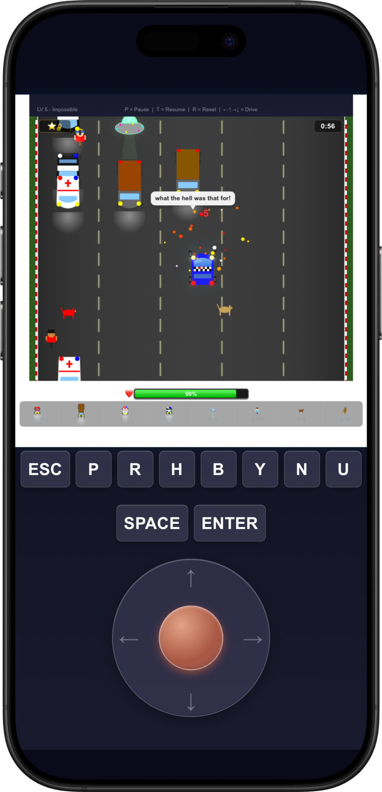

# Road Racer 2026

A vibe coding craft by Leo, a 10 year old boy.

This is a game, at `mobile/assets/RoadRacerGame.html`, created by my 10-year-old son Leo in 2026, with vibe coding assisted by Claude Code and DeepSeek LLM. I am honored to help wrap it up into an iOS mobile app.

  

Road Racer 2026 is a top-down browser game written as a single self-contained HTML file — pure HTML/CSS/vanilla JS on an HTML5 `<canvas>`, no build step, no dependencies. The same HTML is also wrapped in a Flutter iOS app (`mobile/`) so the game can ship as an iPhone app.

The game lives at `mobile/assets/RoadRacerGame.html`. That's both Flutter's native asset path (so the iOS app picks it up with no symlink or copy step) and the docroot for the local web dev server, so the same file powers both targets.

See [DEVELOPING.md](DEVELOPING.md) for the tech stack.
